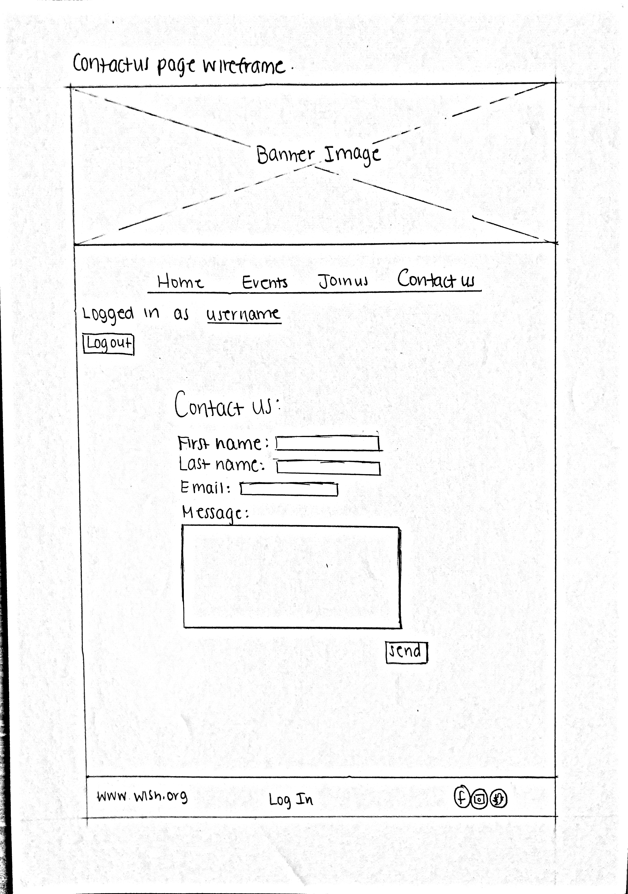

# Design & Plan

### Client Description

Our client is Make a Wish at Cornell. They are a relatively new club on campus hoping to make an impact by raising money and awareness for the Make a Wish Foundation. Make a Wish at Cornell is a little less than two years old, and they currently do not have a website. Therefore, they have to rely heavily on social media platforms such as Facebook and Instagram to communicate club information. Our team excited create a new website for them in the upcoming weeks.

Make a Wish at Cornell wants a website that Cornell students, Ithaca residents, and prospective members can visit in order to learn information about the club. They hope that having an official website will help further establish their presence on campus and assist in publicizing their fundraising events.

Website goals:
- Excellence in both usability and design. Website should be professional, clean, well organized, and easy to use.
- Focus especially on catering towards prospective club members because client is looking to expand.
- Display club event information in an engaging way to help spread the word and increase campus awareness/involvement.

## Client Requirements

### Target Audience(s)

1. Prospective Club Members: These users are typically looking to get involved with a volunteer organization on campus and are drawn specifically to Make a Wish at Cornell because they are familiar with the organization. Prospective club members are on the website to look for recruitment and contact information. The client has also noted that prospective club members are usually underclassmen pre-med students.

2. Cornell/Ithaca community:  This audience typically comprises of people who have had previous experiences/ties with Make a Wish and want to continue their contribution to the cause.They likely have interacted/had exposure with the club through their many fundraising events such as bake sales, carnation sales, and 5K runs. These users visit the website to passively learn more about the club and possible upcoming events.


### Purpose & Content

Purpose: This website will showcase what Make a Wish at Cornell is all about: What kind of work do they do? How they are tied with the Make a Wish Foundation? How  can you support? How can you get involved?

Main Content:
- Club mission statement
- Articles about past and future club events
- Recruitment information about how to join
- Image slideshow gallery
- Contact Form

### Needs and Wants

**Needs and Wants #1**
 * Client wants to actively recruit new members for the club

**Design Ideas and Choices**
 * Create web-page that specifically showcases semester recruitment information, and involvement opportunities
 * Include a contact form so that prospective members can directly send message to the club's email without having to leave the website

**Memo**
 * Client will provide recruitment information
 * Client will provide contact information
 * Contact form will link to client email


**Needs and Wants #2**
 * Client wants to display club events to help publicize more effectively

 **Design Ideas and Choices**
   * Create web-page dedicated to future and past fundraising events
   * Link certain upcoming articles to the About Us page as well as spotlights in an image gallery


 **Memo**
   * Client will provide articles and images to include on webpage


**Needs and Wants #3**
* Client wants to be able to change event articles without having to manually alter the website code


**Design Ideas and Choices**
  * Create Log in/Log out feature that give admin access to functions which allow user to add/ delete event articles


**Memo**
  * Log in accounts will be restricted to E-board members


### Hosting Plan

We will only be creating the website for our client. We do not plan on having any direct involvement on hosting the website. We have made this clear to our client and have given them some information on what is required to host it based on past experience.

### Client's Edits

Yes. We will be creating a login/logout feature for administrators to use which will provide access to adding and removing content from the website as they wish.

### Information Architecture, Content, and Navigation

* **Main Navigation** (Site's navigation bar.)
    * About Us
    * Events
    * Join Us
  * **Content** (Content corresponding to each page in main navigation.)
    * *About Us*
      * Image slideshow showing images of various events that the client did.(Will get images to be displayed from the client)
      * Write a paragraph each about Make a Wish and Make a Wish At Cornell. Will take help of client to write what the client believes the purpose of the club is.
      * List the most recent upcoming events. Will show the 2-3 most recent upcoming events from Events page with just the event's heading and date. Clicking on event Heading will send user to the full article about the event.
      * Login form for the E board members so that they can administrate the site(add/delete events).
    * *Events*
      * List all the Past Events and Upcoming events that the client provides us with. ex- Fundraisers, 5K run. Each event will be displayed in the form of a heading, the date the even took/ will take place, and description about the event. Clicking on event Heading will send user to the full article about the event.
      * A form for logged in users to add events. The form will have text fields Title, Description(for the event), Article Body and a Upload button for uploading the image for the event/article. Also, logged in users will see delete buttons when they go to each full article page which they can use to delete that event and article about the event.
    * *Join Us*
      * List Testimonials of current members(as images and testimonials below each image). This is optional right now, as implementing this feature depends on whether our client will be able to provide us with sufficient testimonials.
      * Write a paragraph about General Recruitment and information about the process. ex- eligibility, deadlines, etc. Will get appropriate information from the client.
      * Make a contact form for potential members and interested people to contact our client directly.

### Interactivity

1) We will have Login/ Logout using a Log In form in About Us page. Logged in users will be able to change events. It will basically be for the E board members so that they can administrate the site(add/delete events). Logging in will thus unlock the extra functionality of adding/ deleting Events. We will use the Accounts table in our database to keep track of usernames and passwords. Logged in users can use the form on Events page to add more events and can use the delete button in each full article page to delete that event and article about the event.

** Interactivity Updated**

2) We will display all events on Events page, but only their heading, the date the event took/ will take place, and description about the event will be listed. The user can click the Heading to read the full article about the event(will use query string parameters and GET to redirect user to appropriate page when Heading is clicked). The new page will have the heading, photo, and full text about the event, which will be displayed using queries to the events table.

Table Events in database will keep store of article title, description, image title, image extension, and article body. A Uploads folder will have all the images to be displayed. This way administrators will be able to add and delete articles as they wish.

[How the interactivity connects with the needs of the clients/target audience.]

1) The Login/Logout feature is for our client. By logging into the website, our client will have access to certain administrative functions that make altering website content easier. This helps fulfill our client's need to update the website event information without having to physically go into the code.

2) Our user's needs include having detailed articles explaining event information. In order to meet this need while still upholding design standards and avoid cluttering the Events page with an overwhelming amount of data, we have decided to add this interactivity feature. This way, the user can still browse through the main headlines, and then choose to read further by clicking on the respective headers.

### External Code

We will use jQuery to implement the Image Slideshow on About Us page.
We will do what we did in 1300 to incorporate jQuery in our website code( i.e. will have a scripts folder with jquery-3.2.1.min.js and all .js files in it which we link to our php files using script src="scripts/jquery-3.2.1.min.js" type="text/javascript" ).
Except the Image Slideshow, all other code will be our own and will be used to satisfy the project requirements. We will also use Google Web Fonts, which we will host locally in our Git repository.

### Scale

Our site will be three pages, and it will take around 18 hours of work to complete it per week.

## Work Distribution

Jesse will be responsible for the navigation bar, the footer (at the bare minimum will include links to the organization's social media accounts), the contact form, the accounts table within the database, and the accounts table's respective SQL.

Adrianne will be responsible for the login/logout form, obtaining the content (including but not limited to: About Make a Wish, About Make a Wish in Cornell, and Upcoming Events) and writing its respective html, and creating the final copy of the wireframes.

Amartya will be responsible for the image slideshow on the About Us page, the add/delete articles functionality given to an admin upon signing into the website, the articles table within the database, and the articles table's respective SQL.

The styling of the website will be shared by everyone on the team. As such, the sketches will be done together to create a design everyone within the group agrees on. Afterwards, each member of the team will be responsible for the styling of their respective contributions unless a member has significant difficultly on their part.

The navigation bar, contact form, and login/logout form will take initial priority. The navigation bar will be needed to access the content on each page of the website while the two forms will be needed to effectively pass along information to the server.
Following this will be the SQL and PHP code that goes alongside it. This way we have functionality of the website and can then begin working on the website's content based on what the client sends our way.

For non-coding milestones, we will be distributing the workload evenly across the team. Everyone's work will have a hard deadline on Monday midnight. On each Monday we will be meeting as a team to examine the work, push together, then assign the work for the next milestone.

## PHP Interactivity

1) We will have Login/ Logout using a Log In form linked at the bottom of every page in the footer. Logged in users will be able to add upcoming events, delete upcoming events, move events from upcoming to past events, and delete past events. This functionality will allow E-board members to administrate what events the website will be advertising to the public. We will use the Accounts table in our database to keep track of usernames and passwords. Logged in users can use the form on Events page to add more events or the delete button for each past event to delete said event. Logged in users can also use the delete button and move button in each full article page to delete that event and article about the event or move the event over to past events. We will accomplish this by using a variable $current_user that stores the logged in username. If $current_user isset, we will let the user have access to these extra functions.

2) We will display all upcoming events on the Events page. Up front this will only include their title and the date the event took/ will take place. The user can click the title of the event or the associated image to read the full article about the event(will use query string parameters and GET to redirect user to appropriate page when either of the two is clicked). The new page will have the title, the image, and the full text description about the event. These will be displayed using queries to the current_events table in the database. The add, delete, and move actions an administrative user can use to alter events will be implemented using the Current_events table and the Past_events table along with the various sql queries associated with each action.

3) We will also display all previous events on the Events page. These are much smaller snippets of the events in comparison to upcoming events and only include a title and a description of how the event went. These are handled using the Past_events table and includes a delete button for administrative users, which again functions using sql queries.

4) We will also be including a contact form for users of the site to send a message to members of the club's eboard. Most fields within the form will be required and all will be thoroughly filtered in order to prevent vulnerabilities for the website. Once all fields have been taken in by the server, an email will be sent out to the member of the eboard that is designated to receive emails.   

Tables in the database will keep store of article title, image title, image extension, article body, etc. A Uploads folder will have all the images to be displayed. This way administrators will be able to add and delete articles as they wish.

## Sketches, Navigation & Wireframes

### Sketches


### Navigation


* About Us (top-level)
* Events (top-level)
* Join Us (top-level)
* Contact Us (top-level)

The About Us page will have all the important information related to the club, and the Log In form. It will have the following content:

  * Banner Image  
  * Navigation bar
  * Write a paragraph each about Make a Wish and Make a Wish At Cornell. Will take help of client to write what the client believes the purpose of the club is.
  * Image slideshow showing images of various events that the client did.(Will get images to be displayed from the client)
  * Link to login form in footer
    * Login form for the E board members so that they can administrate the site(add/delete events).
  * Link to client's social media using social media icons as links.

The Events page will have all the past and upcoming events, and the Add Events form. It will have the following content:

  * Banner Image
  * Navigation bar
  * List all the Upcoming events that the client provides us with. ex- Fundraisers, 5K run. Each upcoming event will be displayed in the form of a location(as where), date(as when), heading and image(picture of event). Clicking on event Heading for the upcoming event will send user to the full article about the event.
  * List all the Past events that the client provides us with. Each past event will be displayed in the form of a heading and description.
  * A form for logged in users to add events. The form will have text fields Title, Location, Date, Article Body and a Upload button for uploading the image for the event/article. Also, logged in users will see delete buttons when they go to each full article page which they can use to delete that event and article about the event.
  * Link to login form in footer
    * Login form for the E board members so that they can administrate the site(add/delete events).
  * Link to client's social media using social media icons as links.


The Join Us page will have all the information related to member recruitment, and the contact form for potential members and interested people to contact the client. It will have the following content:

  * Banner Image
  * Navigation bar
  * Write a paragraph about General Recruitment and information about the process. ex- eligibility, deadlines, etc. Will get appropriate information from the client.
  * List Testimonials of current members(as images and testimonials below each image). This is optional right now, as implementing this feature depends on whether our client will be able to provide us with sufficient testimonials.
  * Link to login form in footer
    * Login form for the E board members so that they can administrate the site(add/delete events).
  * Link to client's social media using social media icons as links.


The Contact Us page will have the contact form for potential members and interested people to contact the client. It will have the following content:

  * Banner Image
  * Navigation bar
  * Make a contact form for potential members and interested people to contact our client directly.
  * Link to login form in footer
    * Login form for the E board members so that they can administrate the site(add/delete events).
  * Link to client's social media using social media icons as links.


### Wireframes




## Evaluate your Design


We've selected Abby because she represents a very large demographic of our potential target audience. She uses technology in her everyday life but typically stays within her comfort zone with applications and devices that she is already familiar with. Abby is risk adverse to trying new technologies, and typically will end up blaming herself incase something goes wrong when she's doing unfamiliar computing tasks. Furthermore, We've concluded that designing a website catered towards someone like Abby would require it to be very user friendly, which in turn will make the experience of the website better for the other suggested personas as well.

For this particular assignment, which requires several features that interact with the user, we have to make sure that all the forms are well designed such that users like Abby will not have to guess through the process. We will make sure to include relevant error messages to help eliminate the need for guess and check (specifically in the adding events form). While both anonymous and logged in users may view events individually, only logged in users (e-board members of the club) will be able to see the delete and archive buttons for events that they uploaded. Furthermore, after  the user logs into my website, we will no longer display the log in form in order to avoid confusion, and in place have a log out option. These are some examples on how I specifically intend to make this website more "user friendly".

### Tasks

Task 1: Abby just heard about the Make-a-Wish club at Cornell and wants to know more about the
club after she is on the club's website.

  1. Click on About Us Link in Nav Bar to visit About Us page.
  2. Scroll down to see the Make A Wish and Who We Are paragraphs.

Task 2: Abby wants to apply for e-board of Make-a-Wish at Cornell next semester , so she wants to
look up recruitment information for the club.

  1. Click on Join Us link to visit Join Us page
  2. Browse through the page to see Recruitment Information.

Task 3: Abby wants to run the 5K this semester with her roommates, and she wants to learn more about the upcoming event.

  1. Click on Events link to visit Events page or stay on About Us page and scroll down.
  2. Click on 5K Run event to access all the information.

### Cognitive Walkthrough

#### Task 1 - Cognitive Walkthrough

Task 1: Abby just heard about the Make-a-Wish club at Cornell and wants to know more about the
club after she is on the club's website.

**Subgoal # 1 : Find the right page for About Club information on the website**

  - Will Abby have formed this sub-goal as a step to her overall goal?
    - Yes, maybe or no: Yes
    - Why: Because, she is already familiar and comfortable with the type of information that she needs to find, and hence she will already have planned this action.

**Action #  1 : Clicks on About Us link, which is displayed on navigation bar**

  - Will Abby know what to do at this step?
    - Yes, maybe or no: Yes
    - Why?: Because About Us link is in the navigation bar, Abby will see it immediately when she goes on the website. She tends towards a comprehensive information processing style, which means that she gathers information comprehensively to try to form a complete understanding of the problem. Abby knows the task she must complete, and therefore will notice the About Us link.

  - If Abby does the right thing, will she know that she did the right thing, and is making progress towards her goal?
    - Yes, maybe or no: Yes
    - Why?  Although Abby has low computer self-efficacy, she will know that she completed her task because she will end directed to a webpage that has the Make A Wish and Who We Are paragraphs which she will see when she scrolls down. She may be not sure of herself at first because she sees the Upcoming Events, but we know that Abby learns by gathering information comprehensively, so she will explore the whole page before getting frustrated i.e will scroll down, and as soon as she sees the relevant paragraphs when she scrolls down, she will be sure she did the right thing!

**Subgoal # 2 : Find information specifically regarding About Club information on About Us Page**

  - Will Abby have formed this sub-goal as a step to her overall goal?
    - Yes, maybe or no: Yes
    - Why: Abby will see the relevant Make A Wish and Who We Are paragraphs after eventually scrolling down, which directly correlates with her task. (completing the form completes the task)

**Action #  2 : Stop at relevant section of About Us page after scrolling down and read the About Us paragraphs**

  - Will Abby know what to do at this step?
    - Yes, maybe or no: Yes
    - Why? Abby learns by process, which means that she takes a step by step approach when tackling tasks. Once she is on the About us page, she will see the Make A Wish and Who We Are paragraphs after eventually scrolling down and then make the subgoal to read it.


  - If  Abby does the right thing, will she know that she did the right thing, and is making progress towards her goal?
    - Yes, maybe or no: Yes
    - Why? After successfully finding the paragraphs, Abby will read them and hence will know she got the information she was looking for.

#### Task 2 - Cognitive Walkthrough
Task 2: Abby wants to apply for e-board of Make-a-Wish at Cornell next semester , so she wants to look up recruitment information for the club.

**Subgoal #1 : Find the right page for Recruitment information on the website**

  - Will Abby have formed this sub-goal as a step to their overall goal?
    - Yes, maybe or no: Yes
    - Why? Abby is likely to be familiar with finding information on a website. Because, she is already familiar and comfortable with the type of information that she needs to find, and hence she will already have planned this action.

**Action #1 : Click on Join Us link to visit Join Us page**

  - Will Abby know what to do at this step?
    - Yes, maybe or no: Yes
    - Why? The Join Us is in the navigation bar, so Abby will see it immediately upon visiting the website, and since she already knows what information she is looking for, she will know this is the best place to go and find this information.

  - If Abby does the right thing, will she know that she did the right thing, and is making progress towards her goal?
    - Yes, maybe or no: Yes
    - Why? Upon clicking the Join Us link in the navigation bar, Abby will be sent to the Join Us page of the website where she will see the Student Testimonies. This will give her a good idea that is this is the kind of stuff she is looking for and as we know that Abby learns by gathering information comprehensively, she will therefore explore the whole page i.e will scroll down, and as soon as she sees the Recruitment Fall 2018 information, she will be sure she is on the right page.

**Subgoal #2 : Find information specifically regarding Recruitment information on Join Us Page**
  - Will Abby have formed this sub-goal as a step to their overall goal?
    - Yes, maybe or no: Yes
    - Why? After being moved over to the Join Us page, Abby will understand information regarding the club's recruitment information should be listed somewhere on the page.

**Action #2 : Stop at relevant section of Join Us page after scrolling down and read the Recruitment Information paragraph**
  - Will Abby know what to do at this step?
    - Yes, maybe or no: Yes
    - Why? Abby learns by process, which means that she takes a step by step approach when tackling tasks. Once she is on the Join Us page, she will see the Recruitment Information paragraph after eventually scrolling down and then make the subgoal to read it.

  - If Abby does the right thing, will she know that she did the right thing, and is making progress towards her goal?
    - Yes, maybe or no: Yes
    - Why? After successfully finding the paragraphs, Abby will read them and hence will know she got the information she was looking for.

#### Task 3 - Cognitive Walkthrough

Task 3: Abby wants to run the 5K this semester with her roommates, and she wants to learn more about the upcoming event.

**Subgoal #1 : Find the events information anywhere on the website**

  - Will Abby have formed this sub-goal as a step to their overall goal?
    - Yes, maybe or no: Yes
    - Why? Abby is likely to be familiar with finding information on a website. She understands that for something as important as events, the website's creators would've gone out of their way to provide the information. Because, she is already familiar and comfortable with the type of information that she needs to find, she will already have planned this action.

**Action #1 : Click on Events link to visit Events page/Stay on About Us page and scroll down**

  - Will Abby know what to do at this step?
    - Yes, maybe or no: Yes
    - Why? If Abby is on the About Us page, she will see the Upcoming Events heading and hence will scroll down the About Us page before to get the information she is looking for. If she is on any other page, she will notice the Events link is in the navigation bar, and hence will click it to get to the information she is looking for.

  - If Abby does the right thing, will she know that she did the right thing, and is making progress towards her goal?
    - Yes, maybe or no: Yes
    - Why? Upon clicking the Events link in the navigation bar/ scrolling down the About Us page, Abby will be sent to the Events page of the website/ will see the Upcoming Events section in the About Us page. Hence she will notice a section for Upcoming Events, including the specific 5K event she is looking to learn more about, and this will confirm that she is doing the right thing.

**Subgoal #2 : Find information specifically about the 5K Run on About Us/Events page**
  - Will Abby have formed this sub-goal as a step to their overall goal?
    - Yes, maybe or no: Yes
    - Why? After being moved over to the Events page or staying on About Us page and noticing Upcoming Events Header, Abby will understand that the 5K Run event should be listed somewhere on the page. Since she likes to get a comprehensive overview before taking action, Abby will look over all the events within the webpage and will eventually find the 5K event.

**Action #2 : Click on 5K Run event to access all the information**
  - Will Abby know what to do at this step?
    - Yes, maybe or no: Yes
    - Why? Abby is familiar with other websites and how navigation bars are meant to take visitors to another section of the website. Therefore she understands that she can click on words within the navigation bar. After finding the 5K Run event on the webpage, she's likely to hover the mouse over either the event image or event title and notice it's a link that will take her to what's perhaps a more detailed look at the event.

  - If Abby does the right thing, will she know that she did the right thing, and is making progress towards her goal?
    - Yes, maybe or no: Yes
    - Why? Upon clicking either the 5K Run event's title or image, Abby will be sent to the webpage specifically for the 5K Run. Here the only information available will be about the 5K Run and she'll be able to see far more detail than what was provided on the previous page, and hence she will realize she has found what she was looking for.


### Cognitive Walk-though Results

We have decided to implement two fixes to our design after going through the Cognitive Walkthrough:

 - We modified the Join Us page. We shifted the Recruitment Information to the top of the page and shifted the Student Testimonies to the bottom. We did this because we found that the most important and relevant information of Join us page is Recruitment information, so it should be featured at the top so that if a user like Abby comes to the Join Us page, they immediately know this is the right page for the information they are looking for. Student testimonies are just a supplement to the Recruitment information so they should be given a lesser priority in the Join Us page.
 - We modified the About Us page. We removed the Upcoming Events section from About Us page, and shifted the slideshow to the bottom and the About Club paragraphs to the top of the About Us page. We made these changes for two reasons:
 - Just like Join Us page, the main focus of the About Us page should be the About Club paragraphs, so we shifted them to the top. Slideshow is supplementary so it has low priority in the About Us page.
 - We also removed the Upcoming Events section from About Us page because having Upcoming Events on two pages will confuse a nervous and underconfident user like Abby. Also since we have a whole page dedicated to Events, which is pretty obvious, it makes more sense to just have events on that page and not have them on About Us page since About Us page is about a totally different thing(topic). We want each page in our website to be about a particular thing so that users like Abby don't get confused and feel comfortable using our client's website.

## Database Plan

### Database Schema

Table: accounts
* id: INTEGER {PRIMARY KEY, UNIQUE, NOT NULL, AUTO INCREMENT}
* username: TEXT {NOT NULL, UNIQUE}
* password: TEXT {NOT NULL}

Table: current_events
* id: INTEGER {PRIMARY KEY, UNIQUE, NOT NULL, AUTO INCREMENT}
* title: TEXT {NOT NULL UNIQUE}
* location: TEXT {NOT NULL}
* image_date: TEXT (NOT NULL)
* image_title: TEXT {NOT NULL}
* image_ext: TEXT {NOT NULL}
* article: TEXT {NOT NULL}

Table: past_events
* id: INTEGER {PRIMARY KEY, UNIQUE, NOT NULL, AUTO INCREMENT}
* title: TEXT {NOT NULL UNIQUE}
* description: TEXT {NOT NULL}


### Database Queries

Get the account information of the user logging in
SELECT * FROM accounts WHERE username = :username;

Return all current events
SELECT * FROM current_events;

Return all past events
SELECT * FROM past_events

Add an upcoming event
INSERT INTO current_events (title, location, image_date, image_title, image_ext, article) VALUES (:title, :location, :dateOfEvent, :image_title, :ext, :article);

Add to past event
INSERT INTO past_events (title, description) VALUES (:title, :description);

Select an event from current_events
SELECT * FROM current_events WHERE title= :title;

Select specific current event to view standalone event page
SELECT * FROM current_events WHERE id = :article_id

Delete an event from current_events
DELETE FROM current_events WHERE id = :upcoming_id;

Delete an event from past_events
DELETE FROM past_events WHERE id = :past_id;

## Structure and Pseudocode

### Structure

* index.php - main page for information about the club.
* events.php- page for all users to view all upcoming and past events. Also, will have a Add Events form for logged in users.
* article.php- page for all users to view single article about an individual event.
* contact.php- page for all users to contact the client.
* join_us.php- page for all users to see recruitment information.
* login.php - page for administrators to log in.
* includes/init.php - stuff that is useful for every web page like login/logout code and other useful common functions.
* includes/header.php- will have nav bar that is common to all pages.
* includes/footer.php- will have footer that is common to all webpages.

### Pseudocode

#### index.php

```
Pseudocode for index.php...

include init.php
include header.php

$current_page_id = "index"

html to showcase text about the Make a Wish organization
html to showcase image Slideshow

include footer.php
```

#### events.php

```
include init.php
include header.php

$current_page_id = "events"

if (added event) {
  $article = filter input
  $location = ...
  $title = ...

  begin transaction

  $sql = SELECT FROM current_events WHERE title = :title;
  $params = array(...);
  $records = execute_sql

  $date = ...

  if statements to check if all input is valid information

  if (valid information)
    $sql = "INSERT INTO events (title, location, image_date, image_title, image_ext, article) VALUES (:title, :location, :dateOfEvent, :image_title, :ext, :article)";

    $params = array(":title" => $title, ... ":article" => $article);
    $result = execute query;
    if ($result)
      push "success"
    else
      push "failed to add"

  end transaction
}

if (delete past event) {
  $past_id = filter input
  $sql = DELETE FROM past_events WHERE id = :past_id;
  execute sql
}

if (delete upcoming event) {
  $upcoming_id = filter input
  $image_ext = filter input
  $full_name = upcoming + image_ext

  $sql = DELETE FROM current_events WHERE id = :upcoming_id;
  $params = array(...);
  exec sql
}

if (move from upcoming to past events) {

  begin transaction

  $article_id = filter input
  $image_ext = filter input
  $full name = article_id + image_ext
  $title = filter input
  $description = filter input

  $sql_insert = INSERT INTO past_events (title, description) VALUES (:title, :description);
  $params_insert = array(...);
  $records_insert = exec_sql

  $sql_delete = DELETE FROM current_events WHERE id = :article_id;
  $params_delete = array(...);
  $records_delete = exec_sql

  end transaction
}

// html to print out current events
$sql = SELECT * FROM current_events;
$params = array();
$records = execute query

if ($records)
  html to structure page
  print_record($records)

// html to print out past events
$sql = SELECT * FROM past_events;
$params = array();
$records = execute query

if ($records)
  html to structure page
  print_record($records)


if (admin is logged in)
  // html for add event form

include footer.php
```

#### article.php
```
include init.php
include header.php

$current_page_id = "article"

if (deleted event)
  $sql = DELETE FROM current_events WHERE title = :title;
  $params = array(":title" => $title)
  $results = execute query

if (archived event)
  $money = filter input

  $sql = INSERT INTO past_events (title, money, description) VALUES (:title, :money, :description);
  $params = array(":title" => $title, ":money" => $money, ":description" => $description)
  $records = execute query

  $sql = DELETE FROM current_events WHERE title = :title;
  $params = array(":title" => $title)
  $results = execute query

if (clicked event)
  $article_id = filter input
  $sql = SELECT * FROM current_events WHERE id = :article_id;
  $params = array(...);
  $records = exec_sql

  if ($records)
    // html to print out current event that was clicked

    if (admin logged in)
      // html to print out delete button for event

if (admin logged in)
  // html to move current event into past events + form


include footer.php
```
#### contact.php
```
include init.php
include header.php

$current_page_id = "contact"

if (form submitted)
  $first_name = filter input
  $last_name = filter input
  $phone = filter input
  $email = filter input
  $subject = filter input
  $message = filter input

if (didn't submit form)
  // html for contact form
else
  // send message to eboard member
  // print success message


include footer.php
```

#### join_us.php
```
includes init.php
includes header.php

current_page_id = join_us;

html to showcase information regarding general recruitment and application deadlines
html to showcase Testimonials


includes footer.php
```

#### login.php
```
include init.php
include header.php

$current_page_id = "login"

if ($current_user)
  record_message "Hi $current_user! You're already logged in."
  // print out logout button
else
  record_message "Please log in below."
  // print out login form

include footer.php
```

#### includes/init.php

```
$pages = array ("index" => "Index", "events" => "Events", ...)

// DB helper functions (you do not need to write this out since they are provided.)

db = connect to db

$messages = array();

function record_message {
  array_push($messages, $message);
}

function print_messages {
  global $messages
  push message in array
}

function check_login {
  if (session of current_user)
    return session of current_user
  else
    return null
}

function log_in {
  global $db;

  if (user attempted to log in)
    $sql = "SELECT * FROM accounts WHERE username = :username"
    $params = array(":username" => $username);
    $records = execute sql

    if ($records)
      $account = $records[0]
      if (password verifies)
        // Create the user's php session
      else
        record_message "invalid username or password"
    else
      record_message "invalid username or password"
}

function log_out {
  global $current_user;
  $current_user = null;

  destroy the user's session
}

session_start();
if (user attempted to login)
  $username = filter input
  $password = filter input
  $current_user = log_in($username, $password);
elseif (user attempted to logout)
  log_out();
  record_message "you've successfully logged out"
else
  $current_user = check_login
```

#### includes/header.php
```
html to display the nav bar

```
#### includes/footer.php
```
html linking to client's national organization page
html linking client's social media to social media icons

if (current_user)
  html linking to admins logout page
else
  html linking to admins login page

```
## Additional Comments

We have only implemented the functionality of logged in users being able to change events, because as per our client's needs, the events is going to be the only dynamic content on the website that needs to be constantly updated. Hence, it makes sense to focus on events and not other content, as the other content will not be dynamic as per the client.

As for logged in users changing accounts and passwords, we may add this functionality to the log in page after consulting with our client. Right now, our client is fine with us not having this functionality, as it's a small club. Client wants us to focus on other important aspects of the website for now.

## Updates

We force all articles to have an image. We talked to our client and they said they always make a poster for
upcoming events, so making images mandatory won't really affect them, but not accepting images for some events will mess up the design, conformity and feel of the events page(Upcoming events will look chaotic).

Our login inputs will be at the bottom of our page, which is often not a common place where people look for the login page, but that is exactly why we chose to do this. Login is for administrators, who will already know where they need to login to access extra functionality, but if an user like Abby sees it on top of the page, she will get confused, so placing the login in the footer will make sure our persona Abby has a good user experience.

We changed Home page to About Us page after reading your advice!(Changed Home page to About Us page everywhere in the design plan)

We changed Archive Event form to Move to Past Event form, because we weren't actually archiving events; we were just moving them to past event, and our client doesn't really want us to archive events, so using two tables for different fields and purposes is the best choice for us. As for duplicate data, we updated our tables to reflect this. We don't want duplicate events, so duplicate titles are not allowed in our form.


## Final Cognitive Walkthrough

### Tasks

Task 1: Abby is a freshman who is looking to join a volunteer club on campus. She wants to contact the Make-a-Wish at Cornell club e-board because she was involved with Make a Wish back in her home and wants to find out more information about the weekly time commitment.

  1. Clicks on Contact Us link, which is displayed on navigation bar
  2. Fill out and submit contact form

Task 2:Abby wants to apply for e-board of Make-a-Wish at Cornell next semester , so she looks the past events to learn more about the club's history and impact.

  1. Click on Events link to visit Events page
  2. Browse through the individual pages of Past Events

Task 3: Abby wants to run the 5K this semester with her roommates, and she wants to learn more about the upcoming event.

  1. Click on Events link to visit Events page
  2. Click on 5K Run event to access all the information

### Cognitive Walkthrough

#### Task 1 - Cognitive Walkthrough

Task 1: Abby is a freshman who is looking to join a volunteer club on campus. She wants to contact the Make-a-Wish at Cornell club e-board because she was involved with Make a Wish back in her home and wants to find out more information about the weekly time commitment.

**Subgoal # 1 : Find Contact Information on website**

  - Will Abby have formed this sub-goal as a step to her overall goal?
    - Yes, maybe or no: Yes
    - Why: Because, she is already familiar and comfortable with the type of information that she needs to find.

**Action #  1 : Clicks on Contact Us link, which is displayed on navigation bar**

  - Will Abby know what to do at this step?
    - Yes, maybe or no: Yes
    - Why?: Because Contact Us link is in the navigation bar, Abby will see it immediately when she goes on the website. She tends towards a comprehensive information processing style, which means that she gathers information comprehensively to try to form a complete understanding of the problem. Abby knows the task she must complete, and therefore will notice the Contact Us link.

  - If Abby does the right thing, will she know that she did the right thing, and is making progress towards her goal?
    - Yes, maybe or no: Yes
    - Why?  Although Abby has low computer self-efficacy, she will know that she completed her task because she will end directed to a webpage that only has a contact form.

**Subgoal # 2 : Make inquiry using contact form**

  - Will Abby have formed this sub-goal as a step to her overall goal?
    - Yes, maybe or no: Yes
    - Why: Abby will see the form the contact us page, which directly correlates with her task. (completing the form completes the task)

**Action #  2 : Fill out and submit contact form**

  - Will Abby know what to do at this step?
    - Yes, maybe or no: Yes
    - Why? Abby learns by process, which means that she takes a step by step approach when tackling tasks. Once she is on the Contact us page, she will see the contact us form and then make the subgoal to complete it.


  - If  Abby does the right thing, will she know that she did the right thing, and is making progress towards her goal?
    - Yes, maybe or no: Yes
    - Why? After successfully completing and submitting the form, Abby will see a message printed on her screen that tells her exactly that.

#### Task 2 - Cognitive Walkthrough
Task 2: Abby wants to apply for e-board of Make-a-Wish at Cornell next semester , so she looks the past events to learn more about the club's history and impact.

**Subgoal #1 : Find events information on the website**

  - Will Abby have formed this sub-goal as a step to their overall goal?
    - Yes, maybe or no: Yes
    - Why? Abby is likely to be familiar with finding information on a website. She understands that for something as important as events, the website's creators would've gone out of their way to provide the information.

**Action #1 : Click on Events link to visit Events page**

  - Will Abby know what to do at this step?
    - Yes, maybe or no: Yes
    - Why? The Events link is in the navigation bar, so Abby will see it immediately upon visiting the website. Even if she scrolls through the entire About Us page before clicking on it, she will realize that the information she is looking for isn't available on her current web page. After processing this realization, she will move forward and click the Events link in the nav bar.

  - If Abby does the right thing, will she know that she did the right thing, and is making progress towards her goal?
    - Yes, maybe or no: Yes
    - Why? Upon clicking the Events link in the navigation bar, Abby will be sent to the Events page of the website that is entirely dedicated the Make a Wish events and fundraisers.

**Subgoal #2 : Find information specifically regarding past events on Events Page**
  - Will Abby have formed this sub-goal as a step to their overall goal?
    - Yes, maybe or no: Yes
    - Why? After being moved over to the Events page, Abby will understand information regarding the club's past events and impact should be listed somewhere on the page.

**Action #2 : Browse through the individual pages of Past Events**
  - Will Abby know what to do at this step?
    - Yes, maybe or no: Yes
    - Why? Abby likes to have a comprehensive overview of things that she interacts with. In this case, having a comprehensive understanding of the club's past events directly links with her task so she will be compelled to perform this action.

  - If Abby does the right thing, will she know that she did the right thing, and is making progress towards her goal?
    - Yes, maybe or no: Yes
    - Why? Abby will see while visiting the individual pages of the past events that she has successfully completed her task.

#### Task 3 - Cognitive Walkthrough
Task 3: Abby wants to run the 5K this semester with her roommates, and she wants to learn more about the upcoming event.

**Subgoal #1 : Find events information on the website**

  - Will Abby have formed this sub-goal as a step to their overall goal?
    - Yes, maybe or no: Yes
    - Why? Abby is likely to be familiar with finding information on a website. She understands that for something as important as events, the website's creators would've gone out of their way to provide the information.

**Action #1 : Click on Events link to visit Events page**

  - Will Abby know what to do at this step?
    - Yes, maybe or no: Yes
    - Why? The Events link is in the navigation bar, so Abby will see it immediately upon visiting the website. Even if she scrolls through the entire About Us page before clicking on it, she will realize that the information she is looking for isn't available on her current web page. After processing this realization, she will move forward and click the Events link in the nav bar.

  - If Abby does the right thing, will she know that she did the right thing, and is making progress towards her goal?
    - Yes, maybe or no: Yes
    - Why? Upon clicking the Events link in the navigation bar, Abby will be sent to the Events page of the website. Here she will notice a section for Upcoming Events, including the specific 5K event she is looking to learn more about.

**Subgoal #2 : Find information specifically about the 5K Run on website**
  - Will Abby have formed this sub-goal as a step to their overall goal?
    - Yes, maybe or no: Yes
    - Why? After being moved over to the Events page, Abby will understand that the 5K Run event should be listed somewhere on the page. Since she likes to get a comprehensive overview before taking action, Abby will look over all the events within the webpage and will eventually find the 5K event.

**Action #2 : Click on 5K Run event to access all the information**
  - Will Abby know what to do at this step?
    - Yes, maybe or no: Yes
    - Why? Abby is familiar with other websites and how navigation bars are meant to take visitors to another section of the website. Therefore she understands that she can click on words within the navigation bar. After finding the 5K Run event on the webpage, she's likely to hover the mouse over either the event image or event title and notice it's a link that will take her to what's perhaps a more detailed look at the event.

  - If Abby does the right thing, will she know that she did the right thing, and is making progress towards her goal?
    - Yes, maybe or no: Yes
    - Why? Upon clicking either the 5K Run event's title or image, Abby will be sent to the webpage specifically for the 5K Run. Here the only information available will be about the 5K Run and she'll be able to see far more detail than what was provided on the previous page.

### Final Cognitive Walk-though Results

Yes. We initially found it difficult for Abby to find where to contact the organization. We had planned to place the contact form in the "Join Us" page of the website since people planning to join would likely want to contact the organization. However, we realized that if the visitor only wanted to contact the organization and not join them, they would be unlikely to visit the "Join Us" page. Therefore we moved the contact form into an entirely new page and added a link to it on the navigation bar.

## Final Notes to the Clients

The client will need to find their own means through which to host the website. One way this could be done is through Heroku's services. The
client will need to obtain the files for the website on their computer and paste the file path of the project into the terminal. They will then need to login to their Heroku account through the terminal (if an account doesn't exist, they will need to create one). Once logged in, the client will need to create the Heroku project using the "create" command and add any necessary server configuration files to the website's project folder. Once done, the client can push to the Heroku master and a domain name will be available for the client to access the page. If a specific domain name is preferred over Heroku's randomly generated one, the client will need to register the domain name and configure it with Heroku before being able to use it.

All client needs were realized within the final product. However, there is some functionality with passwords that we would've liked to add that should still be considered in the future for the sake of security.

The ability for the client to change the passwords of the two administrative accounts. There may be instances where someone who had access to the admin accounts, and subsequently the website, may no longer have the client's best interests in mind. Having the ability to change the passwords would prevent any unwanted tampering with information on the website once website control changes hands. To make this functionality more effective, there are currently two admin accounts in the database so that there can always be at least two people with access to the website. Once changing password functionality is added, there would be no way for one person to have all the control over the website as long as they only have access to one of the accounts. Also, the passwords for each account are currently placeholders. We will be requesting a preferred password for each account before sending the website over to the client so that we can change the value of the password in the database accordingly.


### Strengths of the Website:

  1. The website effectively caters towards both anonymous and logged in users without breaking the integrity of the platform's design. For example, because only club e-board members have accounts and therefore access to the logged in user privileges, the website displays the log in form link in the footer of the website. We chose to put it out of the immediate sight of anonymous users to minimize the possibility of someone like Abby stumbling upon the form and getting horribly confused. After a user is logged in, forms will appear in both the events and individual events page, along with a few delete buttons. However, these are the only major changes in terms of the layout/design of the website.


  2. The website is easy to navigate for both anonymous and logged in users. The website uses a simple information architecture that only features four distinct webpages(excluding the login form , and the individual event page). Each individual webpage includes unique content, and users will not have to spend time guessing to find the information they are looking for.

  3. All the forms on the website are easy to use. We included descriptions for each field, required/optional indicators accordingly, and detailed error messages to assist users like Abby fill out the forms correctly.

[Things that don't work, what we wanted to implement, or what we would do if you keep working with the client in the future.]

- If we had the chance to work with our client for longer, we would have included a function that allows users to change passwords/ add accounts to the website. This way, they would not have to manually go into the code to make such adjustments. Currently, we have it arranged with our client that the admin account information will be passed down to the appointed e-board member in charge of maintaining and updating the website. However, for security reasons we realize that it may be appropriate to eventually incorporate a add account/ change password feature to the website.
- As mentioned previously, The Make a Wish at Cornell club is very new. For this reason, they did not have a lot of content to actually feature on the website. We have tried our best to accommodate by creating/providing placeholder articles, events, and images as needed .

### Design Changes/ Discrepancies between wireframes and Final Website:
  1. "Home" gets changed to "About Us"
    - We decided early on that it was more appropriate to title the Home Page --> "About Us" instead. It fit with the content on the page better.
  2. Upcoming Events is not shown on the About Us page
    - After changing the name of the index page to "About Us", it didn't seem logical to include information about upcoming events, when users would just see that data once more on the Events page. In fact, we realized that it may even cause some confusion for people like Abby, so we decided to only display Upcoming events on the corresponding "Events" page.
  3. Did not end up including a Money counter.
    - Our client did not wish to include a money counter in the end. Because the club is still so new and small, they argued that it might be counter productive to their cause. They would rather keep that information to themselves instead of broadcasting it on their official club website.
  4. Recruitment information got featured before the Student Testimonials on the Join Us page.
    - After reviewing the needs and wants of our client, and walking through the user's experience. We decided that users visiting the Join Us page would appreciate to see recruitment information at the top of the page. This simple change would save them from having to scroll to the bottom of the webpage to find this information.  
